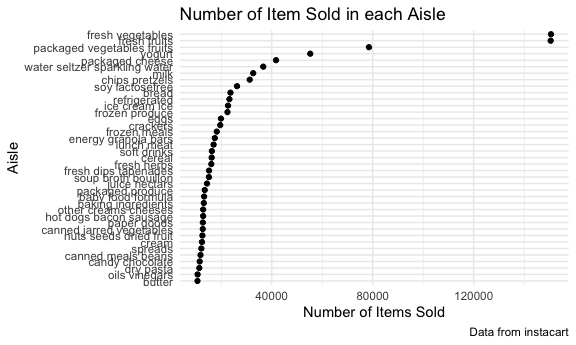

p8105\_hw3\_ym2813
================
Anna Ma
10/15/2021

``` r
library(tidyverse)
```

    ## ── Attaching packages ─────────────────────────────────────── tidyverse 1.3.1 ──

    ## ✓ ggplot2 3.3.5     ✓ purrr   0.3.4
    ## ✓ tibble  3.1.4     ✓ dplyr   1.0.7
    ## ✓ tidyr   1.1.3     ✓ stringr 1.4.0
    ## ✓ readr   2.0.1     ✓ forcats 0.5.1

    ## ── Conflicts ────────────────────────────────────────── tidyverse_conflicts() ──
    ## x dplyr::filter() masks stats::filter()
    ## x dplyr::lag()    masks stats::lag()

## Problem 1

Load the data set

``` r
library(p8105.datasets)
data("instacart")
```

The goal is to do some exploration of this dataset. To that end, write a
short description of the dataset, noting the size and structure of the
data, describing some key variables, and giving illstrative examples of
observations.

``` r
# Find the number of users. 
instacart %>% 
  select(user_id) %>% 
  n_distinct()
```

``` r
instacart %>% filter(order_id == 1)
```

    ## # A tibble: 8 × 15
    ##   order_id product_id add_to_cart_order reordered user_id eval_set order_number
    ##      <int>      <int>             <int>     <int>   <int> <chr>           <int>
    ## 1        1      49302                 1         1  112108 train               4
    ## 2        1      11109                 2         1  112108 train               4
    ## 3        1      10246                 3         0  112108 train               4
    ## 4        1      49683                 4         0  112108 train               4
    ## 5        1      43633                 5         1  112108 train               4
    ## 6        1      13176                 6         0  112108 train               4
    ## 7        1      47209                 7         0  112108 train               4
    ## 8        1      22035                 8         1  112108 train               4
    ## # … with 8 more variables: order_dow <int>, order_hour_of_day <int>,
    ## #   days_since_prior_order <int>, product_name <chr>, aisle_id <int>,
    ## #   department_id <int>, aisle <chr>, department <chr>

This data set has 1384617 rows of 131209 users, and 15 columns. The rows
represents the products from the orders, and the variables includes
information about the order, user,and the product. Some of the key
variables includes order\_id, product\_id, user\_id, order\_number,
order\_dow, product\_name, aisle, and department. For example, the first
observation from the data set gives the information that this product,
identified by product\_id 49302, is in order number 1, which was placed
by the user with user id 112108. This is the first product that the user
added to the cart and it’s been ordered before, since the variable
“reordered” is 1. This is the 4th order of the user from instacart and
it was placed on the 4th day of the week at 10 o’clock. The last order
by the same user was 9 days ago. More specifically about this product,
it is the Bulgarian yogurt from the yogurt aisle, with aisle id 120 and
the dairy eggs department, with department id 16.

Then, do or answer the following (commenting on the results of each):

How many aisles are there, and which aisles are the most items ordered
from?

``` r
# The number of aisles
aisles_n = instacart %>% 
  select(aisle_id) %>% 
  n_distinct()

aisles_n 
```

    ## [1] 134

``` r
# Which aisles are the most items ordered from
aisle_most = instacart %>% 
  count(aisle,name = "aisle_sum") %>% #count aisles
  filter(aisle_sum == max(aisle_sum)) %>% # find the aisles with most count
  select(aisle)

aisle_most
```

    ## # A tibble: 1 × 1
    ##   aisle           
    ##   <chr>           
    ## 1 fresh vegetables

There are 134 aisles in total, the fresh vegetables aisle is the most
ordered from.

Plot that shows the number of items ordered in each aisle, limiting this
to aisles with more than 10000 items ordered.

``` r
instacart %>% 
  count(aisle, name = "aisle_sum") %>% 
  filter(aisle_sum >= 10000) %>% 
  arrange(aisle_sum) %>% 
  mutate(
    aisle = factor(aisle),
    aisle = forcats::fct_reorder(aisle, sort(aisle_sum))) %>% 
  ggplot(aes(x = aisle_sum, y = aisle)) +
  geom_point() +
  labs(
    title = "Number of Item Sold in each Aisle",
    x = "Number of Items Sold",
    y = "Aisle",
    caption = "Data from instacart")
```

<!-- -->

I organized the aisles from the least of items ordered to the most
ordered so that the plot is more readable

Make a table showing the three most popular items in each of the aisles
“baking ingredients”, “dog food care”, and “packaged vegetables fruits”.
Include the number of times each item is ordered in your table.

``` r
instacart %>% 
  group_by(aisle) %>%
  filter(aisle %in% c("baking ingredients", "dog food care" ,
         "packaged vegetables fruits")) %>% 
  count(product_name, name = "n_times_ordered") %>% 
  arrange(desc(n_times_ordered)) %>% 
  slice(1:3) %>% # only keep the top 3 rows for each group
  knitr::kable()
```

| aisle                      | product\_name                                 | n\_times\_ordered |
|:---------------------------|:----------------------------------------------|------------------:|
| baking ingredients         | Light Brown Sugar                             |               499 |
| baking ingredients         | Pure Baking Soda                              |               387 |
| baking ingredients         | Cane Sugar                                    |               336 |
| dog food care              | Snack Sticks Chicken & Rice Recipe Dog Treats |                30 |
| dog food care              | Organix Chicken & Brown Rice Recipe           |                28 |
| dog food care              | Small Dog Biscuits                            |                26 |
| packaged vegetables fruits | Organic Baby Spinach                          |              9784 |
| packaged vegetables fruits | Organic Raspberries                           |              5546 |
| packaged vegetables fruits | Organic Blueberries                           |              4966 |

From this table, we can see that the top three most popular item in the
baking ingredients aisle is light brown sugar, ordered 499 times, pure
baking soda, ordered 387 time, and cane sugar, ordered 336 times.
Similarly, in the dog food care aisle, the top three most popular
product is snack sticks chicken and rice recipe dog treats, ordered 30
times, organix chicken and brown rice recipe, ordered 28 times, and
small dog biscuits, ordered 26 times. Lastly, the top three most popular
product in the packaged vegetables fruits asile is organic baby spinach,
ordered 9784 times, organic raspberries, ordered 5546 times, and organic
blueberries, ordered 4966 times.

``` r
instacart %>%
  filter(product_name %in% c("Pink Lady Apples","Coffee Ice Cream")) %>% 
  group_by(product_name, order_dow) %>%
  summarize(
    mean_hour = mean(order_hour_of_day)
  ) %>% 
  pivot_wider(
    names_from = "order_dow",
    values_from = "mean_hour"
  ) %>% 
  rename("Sunday" = "0", 
         "Monday" = "1", 
         "Tuesday" = "2", 
         "Wednesday" = "3",
         "Thursday" = "4",
         "Friday" = "5",
         "Saturday" = "6") %>% 
  knitr::kable()
```

    ## `summarise()` has grouped output by 'product_name'. You can override using the `.groups` argument.

| product\_name    |   Sunday |   Monday |  Tuesday | Wednesday | Thursday |   Friday | Saturday |
|:-----------------|---------:|---------:|---------:|----------:|---------:|---------:|---------:|
| Coffee Ice Cream | 13.77419 | 14.31579 | 15.38095 |  15.31818 | 15.21739 | 12.26316 | 13.83333 |
| Pink Lady Apples | 13.44118 | 11.36000 | 11.70213 |  14.25000 | 11.55172 | 12.78431 | 11.93750 |

This is the table showing the mean hour of the day at which Pink Lady
Apples and Coffee Ice Cream are ordered on each day of the week. As we
can see, the mean hour of the day that people order Pink Lady Apples and
Coffee Ice Cream is in the range of 11 o’clock to 14 o’clock. The mean
varies very slightly in each day of the week.
